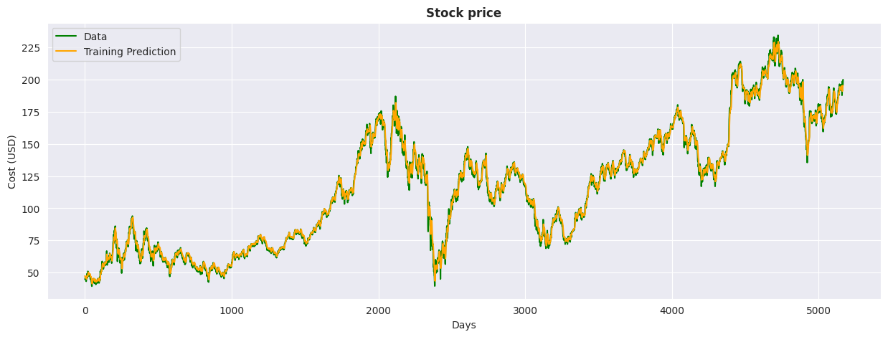
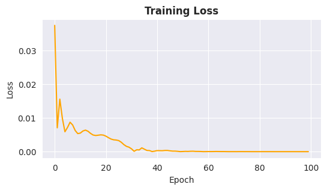
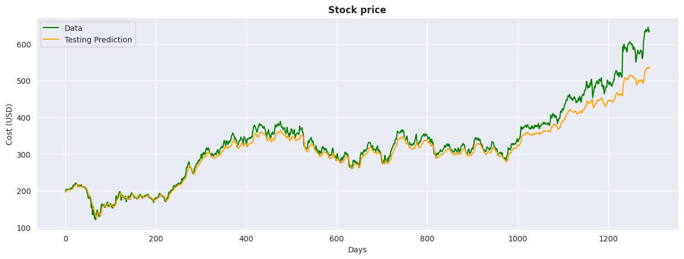

# 📈 Goldman Sachs Stock Price Forecasting Using LSTM and GRU

This project focuses on forecasting the stock prices of **Goldman Sachs** using advanced deep learning techniques, specifically **Long Short-Term Memory (LSTM)** and **Gated Recurrent Unit (GRU)** networks. The model is developed using **PyTorch** and evaluated based on real historical stock price data.

## 🚀 Project Overview

- **Objective:** Predict Goldman Sachs stock prices using time series forecasting techniques.
- **Techniques:** Recurrent Neural Networks (RNN) with LSTM and GRU layers.
- **Performance Metric:** Root Mean Squared Error (RMSE) - achieved **27.08 RMSE** on test data.

## 📊 Technologies & Libraries Used

- **Programming Language:** Python  
- **Deep Learning Framework:** PyTorch  
- **Data Manipulation:** NumPy, Pandas  
- **Data Visualization:** Matplotlib, Seaborn  
- **Metrics:** Mean Squared Error (MSE), Root Mean Squared Error (RMSE)  
- **Data Source:** Historical stock prices from Yahoo Finance (via `yfinance`)

## 🗂️ Project Structure

```
├── data/                 # Historical stock price data
├── notebooks/            # Jupyter notebooks for EDA, model training, and evaluation
├── models/               # Saved models and checkpoints
├── src/                  # Source code for model, preprocessing, and training
│   ├── data_preprocessing.py
│   ├── model.py
│   ├── train.py
│   └── evaluate.py
├── requirements.txt      # Python dependencies
└── README.md             # Project documentation
```

## ⚙️ Installation

1. **Clone the repository:**
   ```bash
   git clone https://github.com/your-username/goldman-sachs-stock-forecasting.git
   cd goldman-sachs-stock-forecasting
   ```

2. **Create a virtual environment (optional):**
   ```bash
   python -m venv venv
   source venv/bin/activate  # On Windows: venv\Scripts\activate
   ```

3. **Install the required packages:**
   ```bash
   pip install -r requirements.txt
   ```

## 📈 How to Run

1. **Prepare the dataset:**  
   Download historical stock price data for Goldman Sachs using the provided script or `yfinance`.

2. **Train the model:**
   ```bash
   python src/train.py
   ```

3. **Evaluate the model:**
   ```bash
   python src/evaluate.py
   ```

4. **Visualize the results:**  
   Run the Jupyter notebook in the `notebooks` folder to view the training progress and predictions.

## 📉 Results

- **Training Loss:** Decreasing trend indicating proper learning.
  
-  
- **RMSE Score:** Achieved **27.08 RMSE** on the test dataset.
- **Visualizations:** Comparison of actual vs. predicted stock prices.
- 

## 🚀 Future Improvements

- Hyperparameter tuning for better performance
- Adding more financial indicators for enhanced forecasting
- Experimenting with hybrid models (e.g., LSTM-GRU combinations)

## 🤝 Contributing

Contributions are welcome! Feel free to open issues, fork the repository, and submit pull requests.

## 📜 License

This project is licensed under the [MIT License](LICENSE).

## ⭐ Acknowledgments

- **PyTorch** for deep learning capabilities
- **Yahoo Finance** for providing historical stock data

---

*Happy Coding! 🚀*

